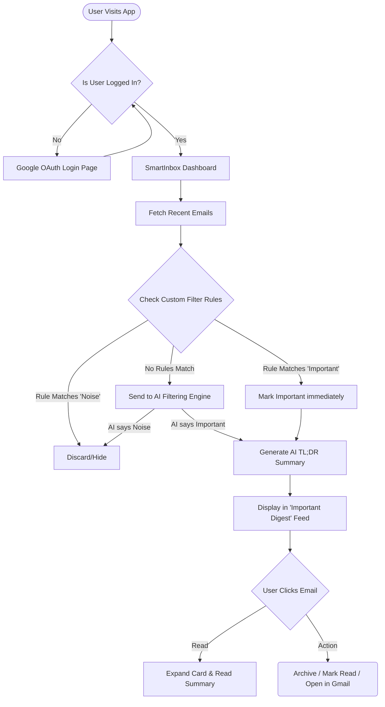
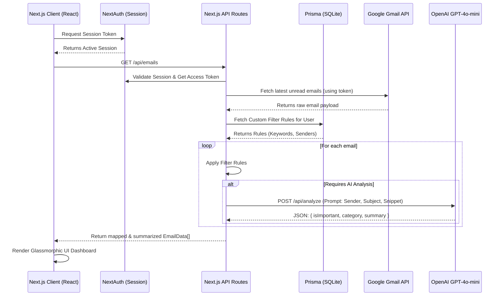
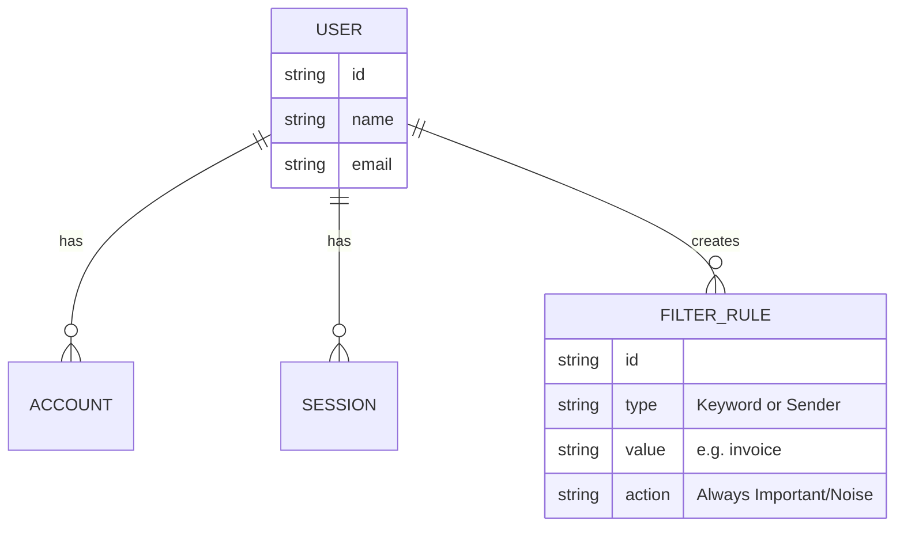

# SmartInbox AI Workflow & Architecture

This document provides visual flowcharts of how data moves through the application, and how users interact with the system.

## User Journey Workflow

This flowchart represents the high-level workflow of a user navigating the application from sign-in to managing their email digests.

## Technical Architecture & Data Flow

This flowchart illustrates the backend infrastructure and how the Next.js server communicates with the external APIs (Gmail API & OpenAI).

## System Components (Entity Relationship)

